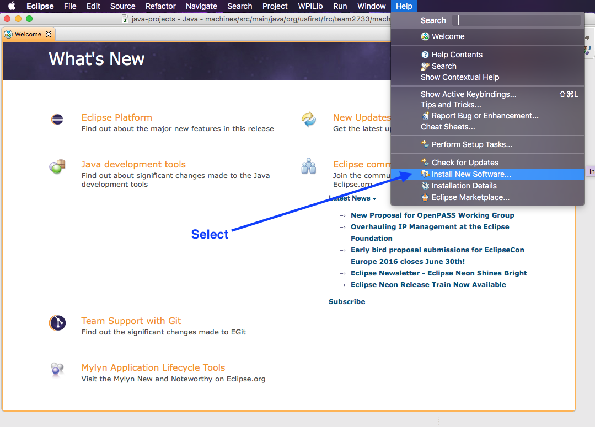

Nothing too crazy; these steps will walk you through downloading; installing and
configuring **Eclipse** to use a GIT project on your local system.

**Note:** These steps assume that you have already downloaded and installed JAVA.

Install Eclipse Neon:
---------------------
First step is to use your web browser to point to [www.eclipse.org](http://www.eclipse.org/):

Then keep clicking...

Then, finally:

You should now have a version of Eclipse for your computers Operating System.

Open the Downloaded File
------------------------
We call this a *tar ball*.  Double clicking on most operating systems should
simply create an Installation application:

Double-clicking on the installer application should bring you a choice.  We want 
**Eclipse IDE for JAVA Developers**:

Follow the rest of the Dialogs (you can choose the defaults).

Install the Robotic Extensions from FIRST:
-------------------------------------------
Find and start the **Eclipse** application you have just installed:

Select **Install New Software** from the **Help** menu:

Click the **Add** button to add a new location where we can get goodies:

Enter the following:
* **Name:** FRC Plugin (this, you can call it anything you want)
* **Location:** [http://first.wpi.edu/FRC/roborio/release/eclipse/)[http://first.wpi.edu/FRC/roborio/release/eclipse/]

Click **OK**
Select the **Robot Java Development** module and click **Next:**

After this is installed, go to the **Workbench** and you should then be able to
follow along with the rest of our instructions for downloading project code.

Connect to Issue Tracker
------------------------
Eclipse has the ability to connect to the Issues we create in our Github repository.
This gives us the following features:

* See what needs to be done from our editor